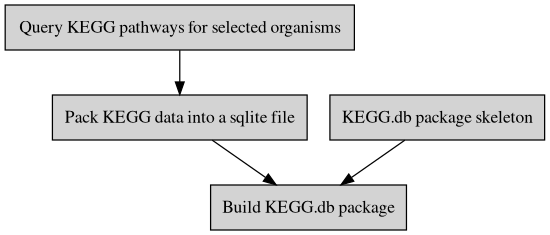

---
output:
  md_document:
    variant: gfm
html_preview: false
---

<!-- README.md is generated from README.Rmd. Please edit that file -->


#  Create KEGG.db Package


```{r comment="", echo=FALSE, results='asis'}
cat(packageDescription('createKEGGdb')$Description)
```


## :writing_hand: Authors

Guangchuang YU and Ziru Chen 


## :arrow_double_down: Installation


```r
## install.packages("remotes")
remotes::install_github("YuLab-SMU/createKEGGdb")
```


## :gear: Workflow




